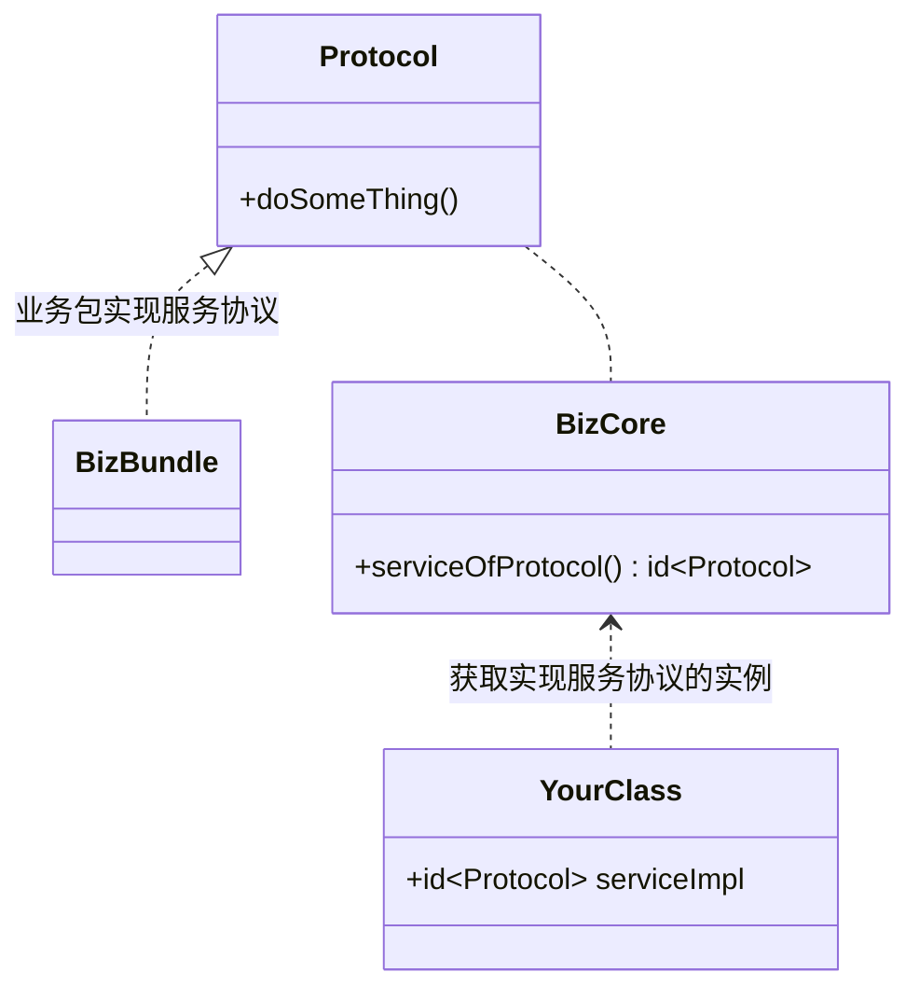
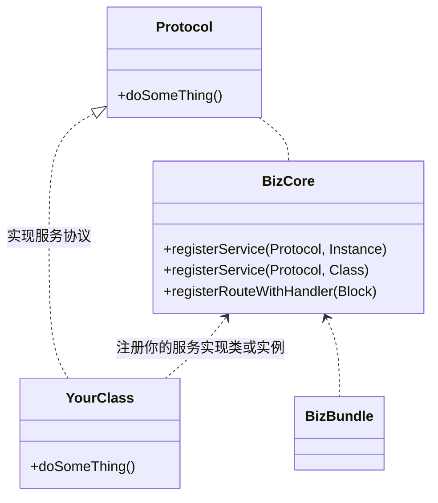

# 涂鸦 iOS 业务包

## 概述

涂鸦 iOS 业务包 (Tuya iOS BizBundle)  是指包含业务逻辑和 UI 界面的涂鸦垂直业务模块，旨在为基于涂鸦全屋智能 SDK 开发的客户提供快速一站式接入涂鸦业务模块的能力。

目前提供的业务包包括：
- 商城
- 设备配网
- 设备控制
- IPC
- 场景
- 云存储
- 常见问题与反馈
- 消息中心

## 架构设计

涂鸦 iOS 业务包以服务化的方式开放，一切功能接入皆以协议 (Protocol) 的方式提供。

协议 (Protocol) 有两种使用方式：**获取服务** 与 **提供服务**

### 获取服务

通过 `BizCore` 获取某业务包提供的服务协议 `Protocol` 实现，之后调用其服务方法，以达到业务目的

### 实现服务

有些业务包依赖的服务协议并没有实现方（例如面板业务包某些情况下会依赖配网服务，在未接入配网业务包的情况下，该服务协议无人实现），这时你可以创建自己的类来实现对应服务协议，并将它注册给 `BizCore` 来完善业务包功能

